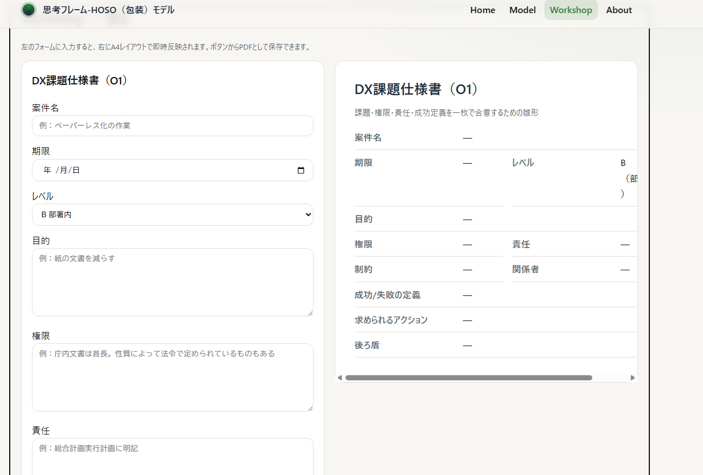

# HOSO (Wrapping) Model - A Thinking Framework

> Wrap your trust into a system.

The HOSO Model is a lightweight thinking framework for public sector digital transformation (DX), designed to connect individual "trust" to a replicable organizational "system". This repository provides an interactive web tool to see, touch, and take home the HOSO concept.

---

### ✨ Features

- **Interactive Workshop**: Create essential DX documents like the "DX Project Charter (O1)" and "PoC Sheet (S)" directly in your browser and save them as PDFs.
- **Lightweight & Fast**: Built with vanilla HTML/CSS/JS with no external dependencies, ensuring it runs smoothly in any environment.
- **Works Offline**: Once loaded, the tool can be used without an internet connection.
- **Accessible Design**: Features a user-friendly interface with dark mode support and considerations for keyboard navigation.
- **Open License (CC BY 4.0)**: Freely remix, transform, and build upon the material, even for commercial purposes, as long as you give appropriate credit.
- **💾 Auto-Save & Privacy**: Your work is automatically saved in your browser's LocalStorage. This data is stored only on your device and is never sent to any server.

### 🚀 Live Demo

Experience the HOSO Model by trying out the interactive tool yourself.

**[▶ Try the Live Demo](https://hosoyayusaku.github.io/hoso-model/)**

### 使い方 (How to Use)

1. **Home**: Get an overview of the project and its core concept.
2. **Model**: Review the purpose and key points of each of the four phases: H, O1, S, and O2.
3. **Workshop**: Interactively create the following A4 sheets:
  - **DX Project Charter (O1)**: To clarify the project's purpose, authority, and responsibilities.
  - **PoC Sheet (S)**: To document the results of small-scale trials and apply learnings to the next steps.
  - **Stakeholder Consensus Memo**: A memo to align perspectives among key parties.
  - **Lessons Learned Sheet**: To capture insights from failures and turn them into organizational assets.
4. **About**: Check the license information for this project.

### 🔧 Development & Contribution

This tool is built with simple, static files.

1. Fork or clone this repository.
2. Edit `index.html` directly.
3. You can review your changes simply by opening the file in your browser.

### ©️ License

This work is licensed under the **Creative Commons Attribution 4.0 International (CC BY 4.0) License**.
You are free to share and adapt this material for any purpose, provided you give appropriate credit. See the [LICENSE](./LICENSE) file for details.

---

# 思考フレーム-HOSO（包装）モデル

> 信頼を、仕組みに包む。

HOSOモデルは、行政DXにおける個人の「信頼」を、組織で再現可能な「仕組み」へとつなぐための軽量な思考フレームワークです。このリポジトリでは、その概念を**観て・触れて・持ち帰れる**インタラクティブなWebツールを提供します。

---

### ✨ 特長

- **インタラクティブな工房（Workshop）**: 「DX課題仕様書（O1）」や「PoCシート（S）」といったDX推進に不可欠な文書をブラウザ上で作成し、PDFとして保存・印刷できます。
- **軽量・高速**: 外部ライブラリに依存しない素のHTML/CSS/JSで構築されており、どんな環境でも軽快に動作します。
- **オフライン動作**: 一度ページを開けば、オフライン環境でもツールを利用できます。
- **アクセシブルな設計**: ダークモード対応やキーボード操作への配慮など、使いやすさを意識したデザインです。
- **オープンライセンス（CC BY 4.0）**: クレジットを表記すれば、営利目的でも誰でも自由に改変・再配布が可能です。
- **💾 自動保存とプライバシー**: 入力内容はブラウザのローカルストレージ（LocalStorage）に自動保存されます。データはあなたのPC上にのみ保存され、サーバーに送信されることは一切ありません。

### 🚀 デモ

実際にツールを触って、HOSOモデルを体験してみてください。

**[▶ Live Demo はこちら](https://hosoyayusaku.github.io/hoso-model/)**

### 使い方

1. **Home**: プロジェクトの概要とコンセプトを掴みます。
2. **Model**: H/O1/S/O2の各フェーズの目的や要点を確認できます。
3. **Workshop**: 以下のA4シートを対話形式で作成できます。
  - **DX課題仕様書（O1）**: プロジェクトの目的・権限・責任を明確にします。
  - **PoCシート（S）**: 小さな試行の結果を記録し、学びを次に繋げます。
  - **三者の“納得”メモ**: 関係者の目線を合わせるための合意メモです。
  - **教訓シート**: 失敗から学びを得て、組織の資産とするための記録です。
4. **About**: このプロジェクトのライセンス情報を確認できます。

### 🔧 開発・貢献

1. このリポジトリをフォークまたはクローンします。
2. `index.html` を直接編集します。
3. ブラウザでファイルを開くだけで、変更内容を確認できます。

### ©️ ライセンス

この作品は**クリエイティブ・コモンズ 表示 4.0 国際 (CC BY 4.0) ライセンス**の下に提供されています。
利用者は、適切なクレジットを表示すれば、営利目的でも自由に共有（複製、再配布）および改変（リミックス、変形、二次利用）することができます。詳細は [LICENSE](./LICENSE) ファイルをご確認ください。
